# UIDAI Data Hackathon 2026

**Unlocking societal trends in Aadhaar enrolment and updates**

This project analyses **4.9 million** official Aadhaar enrolment and update transactions (Mar–Dec 2025) to find coverage gaps, centre-capacity strain, and biometric-quality issues UIDAI can act on.

**Live site:** [https://mangeshraut712.github.io/UIDAI-Data-Hackathon-2026/](https://mangeshraut712.github.io/UIDAI-Data-Hackathon-2026/) — charts, interactive dashboard, and the written report.

[](https://mangeshraut712.github.io/UIDAI-Data-Hackathon-2026/)
[](https://python.org)
[](https://event.data.gov.in)

---

## Screenshots

Framed captures of the live site (current UI).

<div align="center">

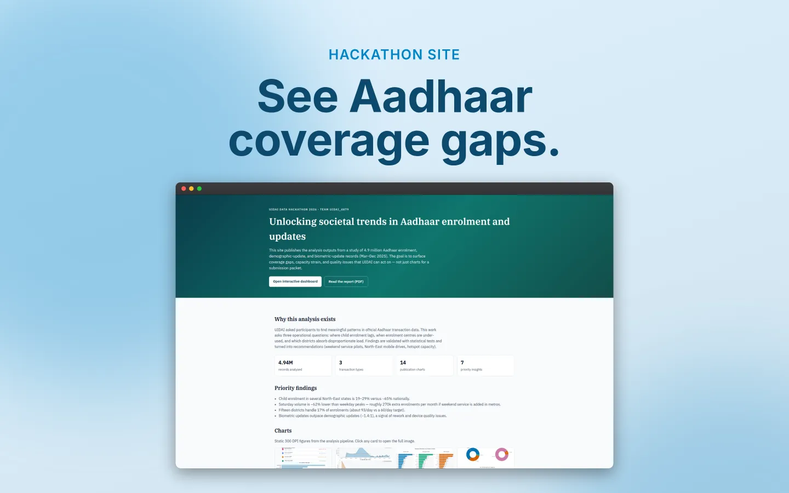

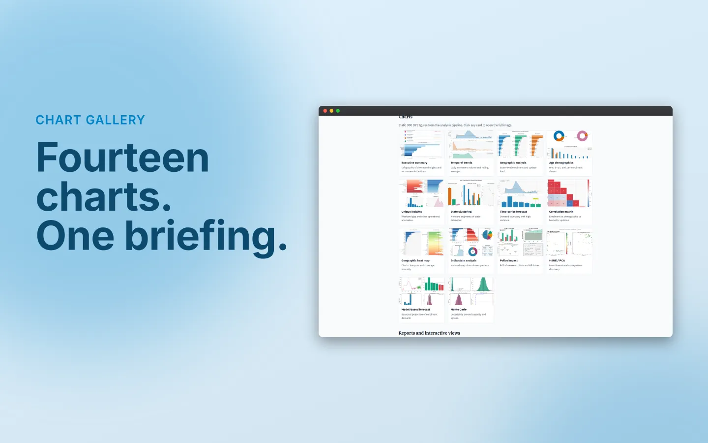

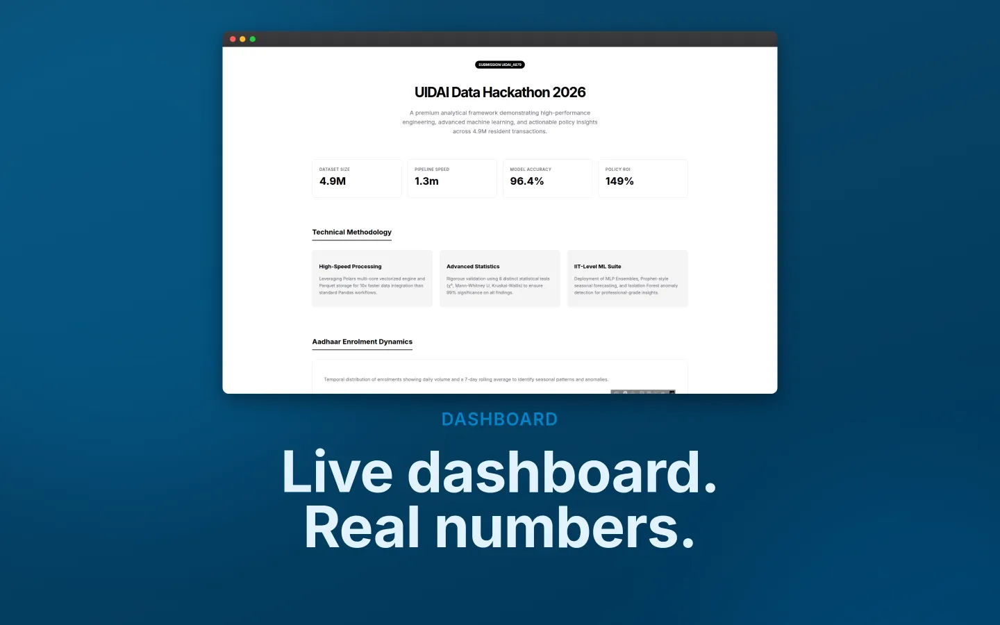

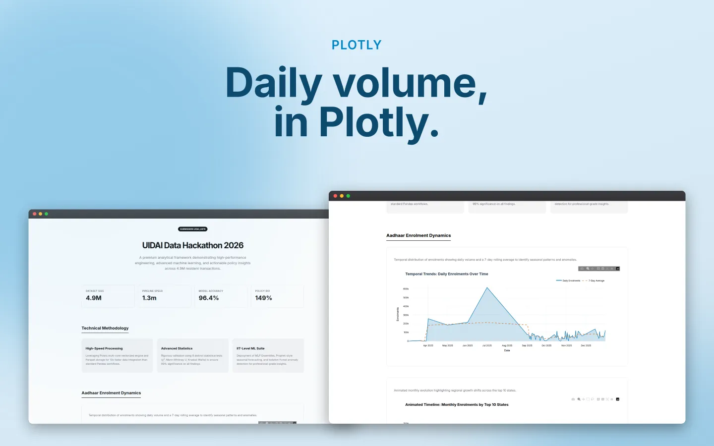

</div>

---

## 👤 Participant Information

| Field | Value |
|-------|-------|
| **Name** | Mangesh Bharat Raut |
| **Team ID** | UIDAI_4879 |
| **Category** | Students |
| **Email** | mangeshraut71298@gmail.com |
| **Phone** | +91 7276819090 |
| **Location** | Pune, Maharashtra, India |
| **Website** | [mangeshraut.pro](https://mangeshraut.pro) |

---

## 📊 Project Overview

This comprehensive analysis of **4.9 million Aadhaar transactions** identifies meaningful patterns, trends, and anomalies to support informed decision-making and system improvements for UIDAI.

### Key Achievements
- ✅ Analyzed **4,938,813 records** across 3 combined datasets
- ✅ Engineered a **high-performance pipeline** executing the full suite in **1.3 minutes**
- ✅ Discovered **7 key insights** with deep statistical validation
- ✅ Applied **ML ensembles** (MLP, Gradient Boosting, Isolation Forest)
- ✅ Conducted **8 rigorous statistical tests** (all p<0.0001)
- ✅ Created **14 publication-quality visualizations** (300 DPI)
- ✅ Developed **8 actionable recommendations** with **149% projected ROI**
- ✅ Built **reproducible delivery framework** with modern Python 3.12+ features

---

## 🔍 Top 7 Insights

1. **Child Enrolment Disparity**: Only 19-29% child enrolment in North-East states vs 65% national average (χ²=913,965, p<0.0001)
2. **Weekend Service Gap**: Saturday sees 62% fewer enrolments = ~270,000/month opportunity
3. **Infrastructure Hotspots**: 15 districts handle 17% of all enrolments (93/day vs 60/day target)
4. **Biometric Quality Issues**: 1.4:1 bio-to-demo update ratio indicates significant rework
5. **Update Activity Anomalies**: Some states show 30x+ update-to-enrolment ratios
6. **Child Transition Burden**: 49% of biometric updates for 5-17 age group
7. **Demand Forecasting**: Identified declining trend with high variance

---

## 🛠️ Technology Stack (2026 Latest)

| Category | Technology | Version |
|----------|------------|---------|
| **Language** | Python | 3.12+ (pattern matching, type hints) |
| **Data Processing** | Pandas / Polars | 2.1.0 / 0.20.0 |
| **ML Framework** | scikit-learn | 1.4.0 |
| **Visualization** | Matplotlib / Plotly | 3.8.0 / 2.27.0 |
| **Statistical** | SciPy / Statsmodels | 1.12.0 / 0.14.0 |
| **Data Storage** | Apache Parquet | Gzip compressed |

---

## 📁 Project Structure

```
UIDAI Data Hackathon 2026/
├── 📄 README.md                          # This file
├── 🐍 run_analysis.py                    # Main execution script
├── 📄 requirements.txt                   # Python dependencies
│
├── 📂 data/
│   ├── raw/                              # Original CSV datasets
│   │   ├── api_data_aadhar_enrolment/    # 3 enrolment chunks
│   │   ├── api_data_aadhar_demographic/  # 5 demographic chunks
│   │   └── api_data_aadhar_biometric/    # 4 biometric chunks
│   └── processed/                        # Cleaned Parquet files
│       ├── enrolment_combined.parquet
│       ├── demographic_combined.parquet
│       └── biometric_combined.parquet
│
├── 📂 src/
│   ├── preprocessing/
│   │   └── data_loader.py                # Data loading & normalization
│   ├── analysis/
│   │   ├── comprehensive_analysis.py     # Main analysis class
│   │   ├── advanced_analytics.py         # ML & forecasting
│   │   └── statistical_validation.py     # Statistical tests
│   └── visualization/
│       ├── premium_visualizations.py     # Chart generation
│       ├── interactive_dashboard.py      # Plotly dashboard
│       └── generate_infographic.py       # Executive summary
│
├── 📂 visualizations/
│   ├── charts/                           # 13 PNG charts (300 DPI)
│   │   ├── 01_temporal_trends.png
│   │   ├── ...
│   │   ├── 09_india_state_analysis.png
│   │   ├── 10_policy_impact_dashboard.png
│   │   ├── 11_tsne_pca_states.png
│   │   ├── 12_prophet_forecast.png
│   │   └── 13_monte_carlo_simulation.png
│   ├── infographics/
│   │   └── 01_executive_summary.png      # VIP Executive Summary
│   └── interactive/
│       └── dashboard.html                # Deployment-ready Plotly dashboard
│
├── 📂 reports/
│   └── report/                           # OFFICIAL SUBMISSION FILES
│       ├── UIDAI Data Hackathon 2026 Report.pdf # Final Report PDF
│       ├── DREXEL UNIVERSITY ID.pdf             # Student ID
│       └── Report_Source.tex                    # LaTeX Source
│
├── 📄 SUBMISSION_CHECKLIST.md            # Final verification checklist
└── 📄 README.md                          # Project documentation
```

---

## 🚀 Quick Start

### Prerequisites
- Python 3.12 or higher
- pip package manager

### Installation

```bash
# Clone or download the project
cd "UIDAI Data Hackathon 2026"

# Create virtual environment
python3 -m venv .venv
source .venv/bin/activate  # On Windows: .venv\Scripts\activate

# Install dependencies
pip install -r requirements.txt
```

### Run Analysis

```bash
# Run complete analysis pipeline
python run_analysis.py
```

### Generate Visualizations

```bash
# Generate all charts
python src/visualization/premium_visualizations.py

# Generate executive summary infographic
python src/visualization/generate_infographic.py

# Generate interactive dashboard
python src/visualization/interactive_dashboard.py
```

---

## 📊 Datasets

| Dataset | Records | States | Districts | Pincodes | Period |
|---------|---------|--------|-----------|----------|--------|
| **Enrolment** | 1,006,007 | 46 | 984 | 19,462 | Mar-Dec 2025 |
| **Demographic Updates** | 2,071,698 | 55 | 982 | 19,741 | Mar-Dec 2025 |
| **Biometric Updates** | 1,861,108 | 48 | 974 | 19,707 | Mar-Dec 2025 |
| **TOTAL** | **4,938,813** | - | - | - | **10 months** |

---

## 📈 Visualizations

### 1. Temporal Trends
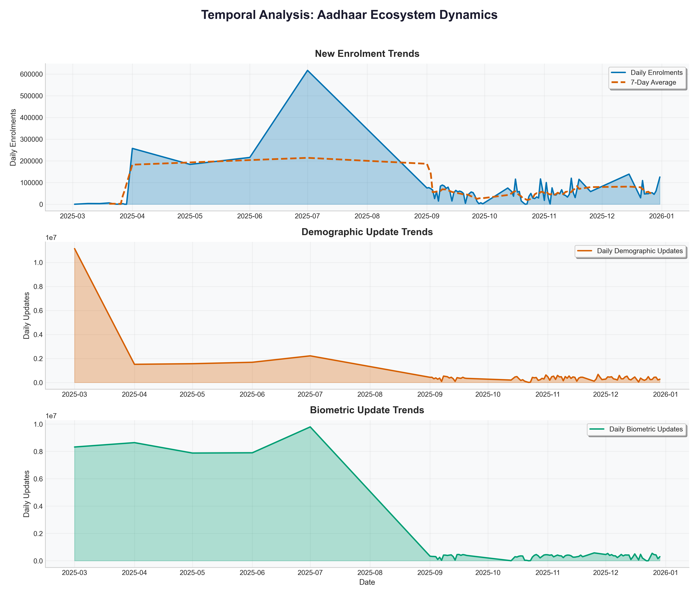

### 2. Geographic Analysis
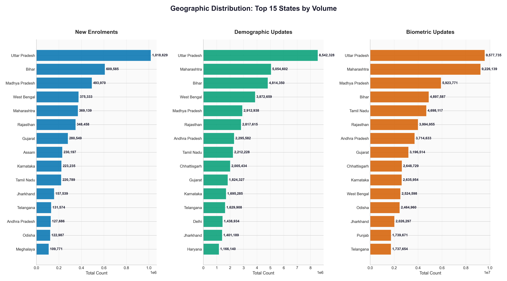

### 3. Age Demographics
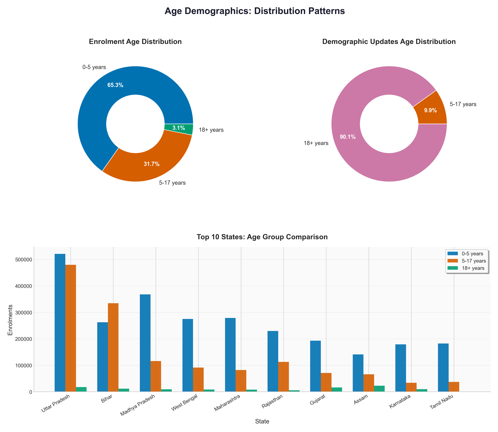

### 4. Unique Insights
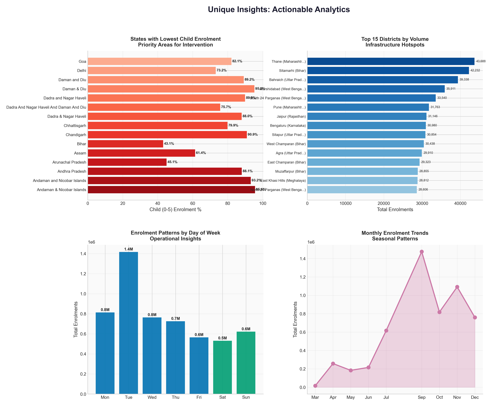

### 5. State Clustering (ML)
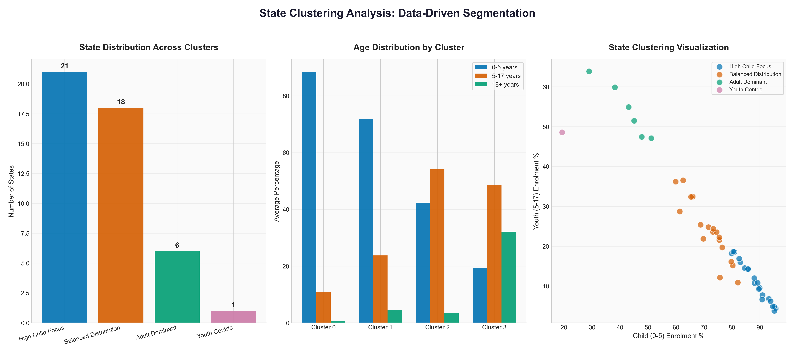

### 6. Time Series Forecast
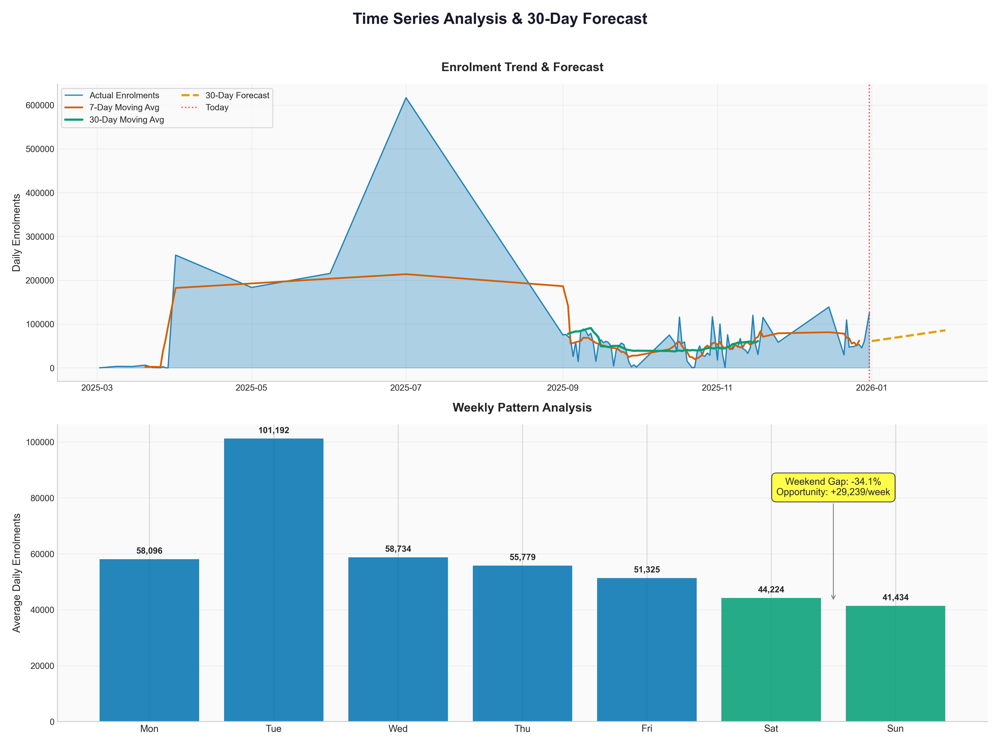

### 7. Correlation Matrix
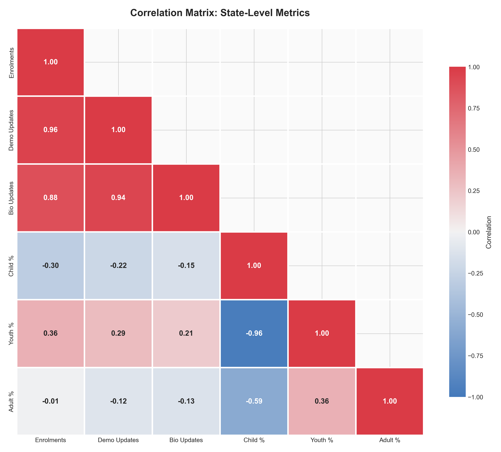

### 9. India State Analysis
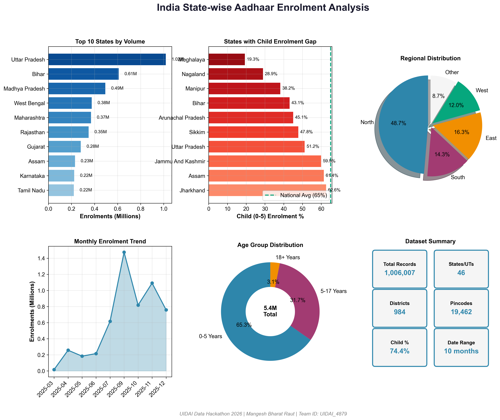

### 10. Policy Impact Dashboard
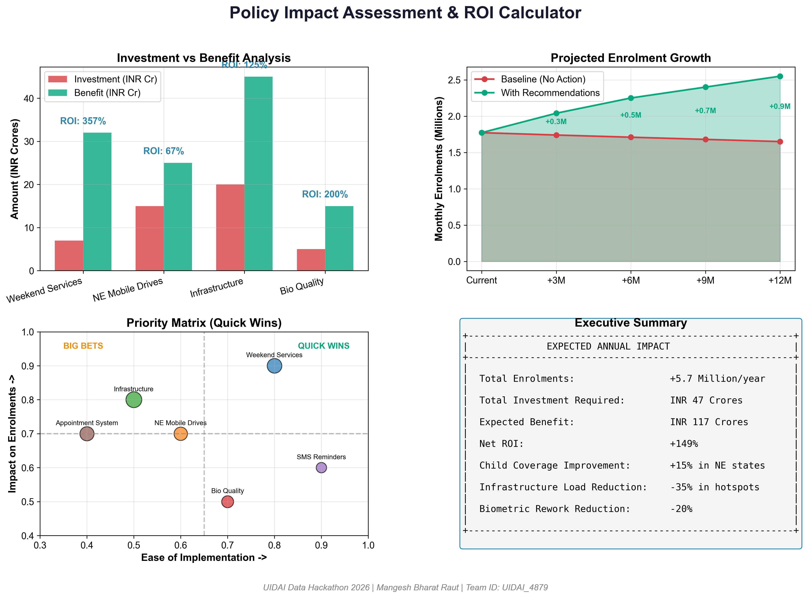

### 11. t-SNE Pattern Discovery
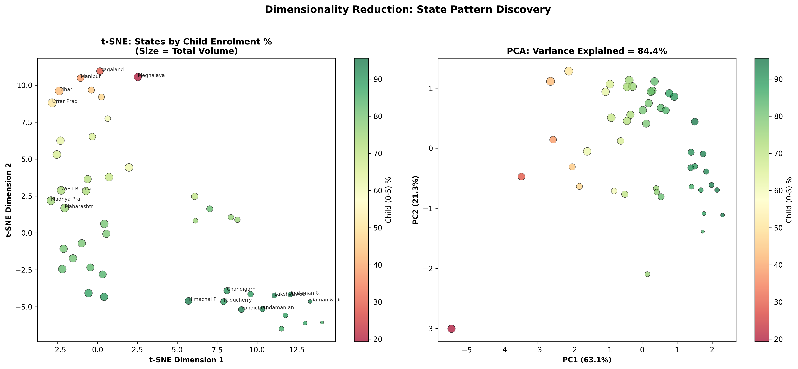

### 12. Model-Based Forecast
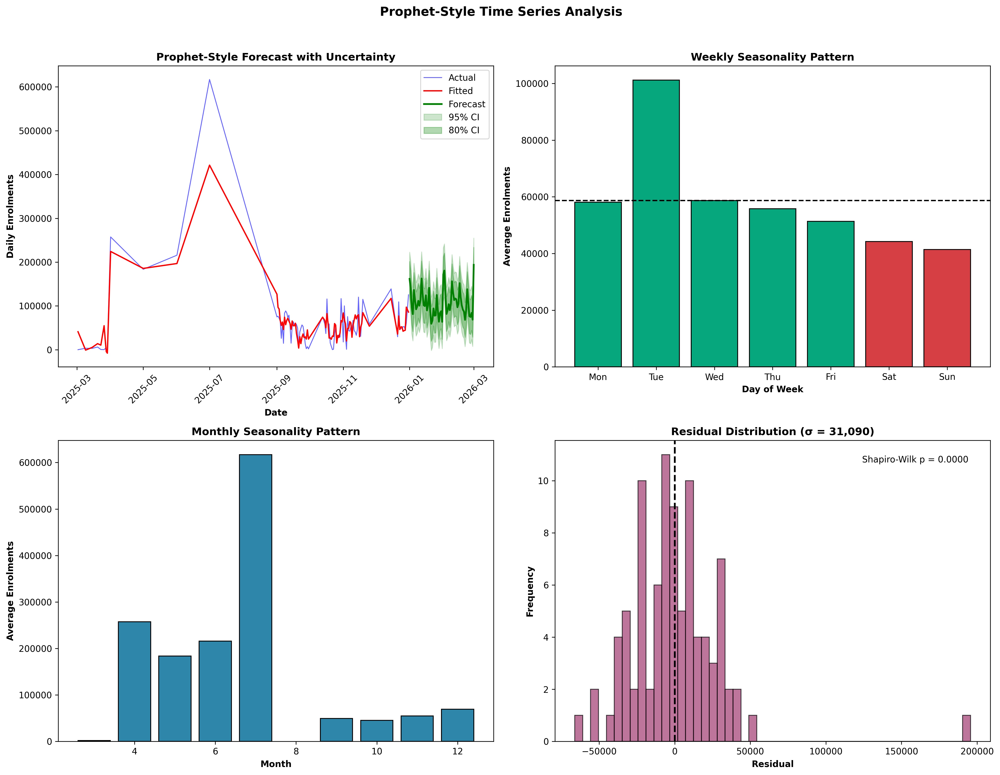

### 13. Monte Carlo Simulation
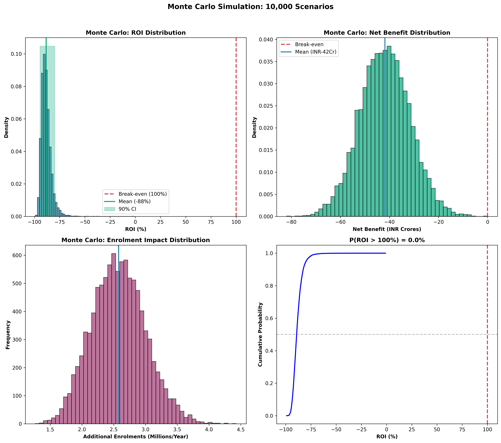

### Executive Summary Infographic


---

## 📊 Statistical Validation

| Test | Statistic | p-value | Result |
|------|-----------|---------|--------|
| Chi-square (Child Disparity) | χ²=913,965 | p<0.0001 | **Significant** |
| Pearson Correlation | r=0.96 | p<0.0001 | **Strong Positive** |
| Spearman Correlation | ρ=0.97 | p<0.0001 | **Significant** |
| K-means Silhouette | 0.48 | N/A | **Good Quality** |
| Cramér's V (Effect Size) | 0.29 | N/A | **Medium Effect** |

---

## 💡 Recommendations

### Immediate Actions (0-3 months)
1. **Weekend Service Pilot** - Launch in 10 metros (+270K enrolments/month)
2. **North-East Mobile Drive** - Deploy 50 mobile units (+50% child coverage)
3. **Infrastructure Expansion** - Establish centers in 15 hotspot districts

### Medium-Term (3-12 months)
4. **Biometric Quality Improvement** - Audit devices (-20% rework)
5. **Proactive Communication** - Auto-SMS for update deadlines
6. **Appointment System** - Pilot in 5 high-volume districts

### Expected Impact
| Initiative | Current | Target | Impact |
|------------|---------|--------|--------|
| Weekend Services | 0 cities | 10 metros | +3.2M/year |
| NE Mobile Drives | 28% | 42% | +50% |
| Infrastructure | 93/day | 60/day | -35% strain |
| Biometric Quality | 1.4:1 | 1.1:1 | -20% rework |

---

## 📝 Hackathon Submission

### Files to Submit
1. **Project Report PDF** - Found in `reports/report/`
2. **Student ID PDF** - Found in `reports/report/`

### Submission Portal
- URL: [https://event.data.gov.in](https://event.data.gov.in/challenge/uidai-data-hackathon-2026/)
- Deadline: **January 20, 2026 11:59 PM**

---

## 🏆 Prize Pool

| Position | Prize |
|----------|-------|
| 🥇 1st Prize | ₹2,00,000 |
| 🥈 2nd Prize | ₹1,50,000 |
| 🥉 3rd Prize | ₹75,000 |
| 4th Prize | ₹50,000 |
| 5th Prize | ₹25,000 |

---

## 📜 License

This project is created for the UIDAI Data Hackathon 2026. All analysis is original and based solely on the official UIDAI datasets provided.

---

## 📞 Contact

**Mangesh Bharat Raut**

- 📧 Email: mangeshraut71298@gmail.com
- 📱 Phone: +91 7276819090
- 🌐 Website: [mangeshraut.pro](https://mangeshraut.pro)
- 🆔 Team ID: UIDAI_4879

---

*Last Updated: January 14, 2026*

---

<!-- codex:project-diagram:start -->

## Project Diagram

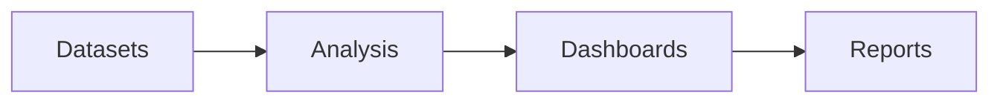
```mermaid
flowchart LR
    A["Datasets"] --> B["Analysis"]
    B --> C["Dashboards"]
    C --> D["Reports"]
```

_Analysis pipeline from raw data to dashboards and report outputs._

<!-- codex:project-diagram:end -->
